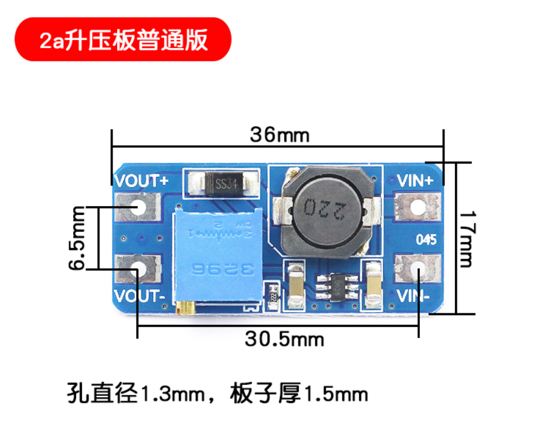

# C4 Clock
自制能爆炸的C4闹钟，再也不怕闹钟叫不醒了（不是

## 介绍
普通的闹钟是叫不醒我这种睡着了就叫不醒的人的，即便声音再响也没用。但是，最近收到了一个新的闹钟，响起来非常像定时炸弹。想到游戏CS:GO里面有一个C4炸弹，可以以它为原型，制作一个C4形状的闹钟，响的时候也像C4那样，就可以很轻易地叫醒人了。

1. 当闹钟响起来之后，必须在30秒内按下键盘上的确认键，否则炸弹里的一个电解电容就会爆炸（当然放个小烟花也是可以的，但是上海弄不到烟花，并且这样的话壳子就不能重复利用了）。
2. 然后屏幕上会有5道数学计算题，每一题15秒，超过时间会爆炸。

## 硬件
MCU采用了乐鑫ESP32-WROOM-32D，支持WiFi+蓝牙，可以自动同步时间，支持通过web端设置闹钟。

PCB文件放在Hardware文件夹下。
> 原理图的J4处是一个直流升压模块，淘宝上有卖的，可以在[这里](https://detail.tmall.com/item.htm?id=41345069371)买到
> 
> 规格如下：
> 
>
> 安装的时候，主板上有对应的四个焊盘，直接一大坨锡糊在四个焊盘上，反正能连上就行了。

## 软件
鉴于Arduino自己的IDE功能太少，不能自动补全也不能单步调试~~我要这废物有何用~~所以想办法弄了一个VS插件（visual micro），可以支持arduino

## 灵感
芜狐ー起飞@bilibili的[计算练习器](https://www.bilibili.com/video/BV1YU4y1j7n4)
